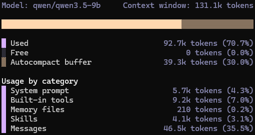
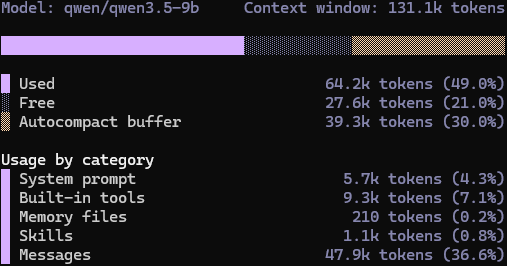

# Lissom Skills

[](LICENSE)
[](https://github.com/cuzfrog/lissom-skills/stargazers)
[](https://github.com/cuzfrog/lissom-skills/commits/main)
[](https://github.com/cuzfrog/lissom-skills)
[](https://github.com/cuzfrog/lissom-skills/actions/workflows/ci.yml)

[English](README.md) · **简体中文** · [日本語](README.ja.md)

```
┌─┐
│L│░ LISSOM  —  Simple, reliable Claude Code skills & agents
└─┘  SKILLS     for daily dev automation and context protection.
```

---

#### 为什么选择 Lissom？与 [GSD](https://github.com/gsd-build/get-shit-done)、[SuperPower](https://github.com/obra/superpowers) 有何不同？
- **零依赖** — 纯文件。
- **薄调度层** — 极致的上下文保护。
- **幂等性** — 最小状态，无忧恢复。
- **严谨规范** — 无惊喜的开发体验。

<table>
  <tr>
    <th>/gsd-autonomous</th>
    <th>/lissom-auto</th>
  </tr>
  <tr>
    <td></td>
    <td></td>
  </tr>
</table>
（在小型本地模型 Qwen Code 上运行 10 分钟任务后的上下文）


#### 何时使用？
- 我有一个想法，帮我完善规范并自动化实现。

#### 何时不使用？
- 简单任务 — 直接在一个代理中完成。
- 探索性任务 — 使用 `/explore`。

### 基本工作流
```
           ┌─ interview ─┐
           │             /
 research ─┘ auto ──►   +   ──► plan ──► impl ──► review ──► done
  Specs.md    Research.md /    Plan.md         Review.md     │
   ▲                     /                                   │ critical?
   │                     └──────────── fix cycle (max 3)  ◄──┘
   │                                          │
   └──────────────── fix cycles exhausted ────┘
```

---

## 安装

在项目目录中执行：

```bash
curl -fsSL https://raw.githubusercontent.com/cuzfrog/lissom-skills/main/scripts/install.sh | bash
```

支持的平台：
- `.claude/` [Claude Code](https://code.claude.com/) 及兼容代理。
- `.opencode/` [OpenCode](https://opencode.ai)。
- `.qwen/` [Qwen Code](https://qwen.ai/qwencode)。
- `.gemini/` [Gemini CLI](https://geminicli.com/)。

### 卸载

删除当前项目中 `.claude/` 和 `.opencode/` 目录中的所有已安装文件：

```bash
curl -fsSL https://raw.githubusercontent.com/cuzfrog/lissom-skills/main/scripts/uninstall.sh | bash
```

仅移除该工具包安装的文件，您自行添加的文件不会被删除。空目录会自动清理。

---

## 开始使用

**运行** `/lissom-auto <task_id>` — 接受访谈，等待任务完成！

1. 工具会在 `.lissom/tasks/<task_id>/Specs.md` 中查找任务
2. 如果未找到，会尝试通过外部工具定位（例如 JIRA MCP）

### 最佳实践

- 使用简单的 [grill-me](doc/grill-me.md) 技能来构建 `Specs.md`。
- 明确定义测试方法（开发周期）（例如在 `CLAUDE.md` 中）。
- 引导行为：`/lissom-auto <task_id> 直接进入规划阶段，我已写好完善的规范。`

---

## 配置

在 `.lissom/settings.local.json` 中设置偏好，避免每次运行时被询问：

```json
{
  "user_attention": "default",
  "fix_threshold": "warning",
  "spec_review_required": "yes",
  "research_required": "yes"
}
```

| 键 | 选项 |
|---|---|
| `user_attention` | `default` — 对主要问题进行访谈；`auto` — 尽量自动处理；`focused` — 详细追问 |
| `fix_threshold` | `warning` — 修复关键和警告问题；`critical` — 仅关键问题；`suggestion` — 全部问题 |
| `spec_review_required` | `yes` — 在研究前评审和完善规范；`no` — 跳过规范评审 |
| `research_required` | `yes` — 实现前进行研究；`no` — 若规范已足够则跳过研究 |

---

## 链接

- [GitHub](https://github.com/cuzfrog/lissom-skills) — 源码与发布
- [Issues](https://github.com/cuzfrog/lissom-skills/issues) — 问题反馈与功能建议
- [License](LICENSE) — MIT

---

## 作者

Cause Chung <cuzfrog@gmail.com>
